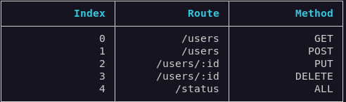

# Express Route List

> List routes for Express Framework

   

[license-url]: https://opensource.org/licenses/MIT

## Install

```bash
npm i -D express-route-list
```

## Setup

If you are using Typescript in project, read [typescript setup](./docs/TSCONFIGURATION.md)

Export the app (regardless of where you are declaring it).

```js
//app.js

module.exports = app;
```

Create a configuration file:

```js
//route-list.js
const { configure } = require('express-route-list');
const app = require('./app');

configure(app, { showIndex: true, prefix: '' });
```

## Execute

Create a script entry in package.json and run.

```bash
npm pkg set scripts.route-list="node route-list.js"
```

```bash
npm run route-list
```

## Output Example



## Why use this package?

This package provides a quick way to easily visualize your application's routes, with a minimal configuration.

## Author

© 2023 - [Joalison Pereira](https://joalisonpereira.github.io/)
